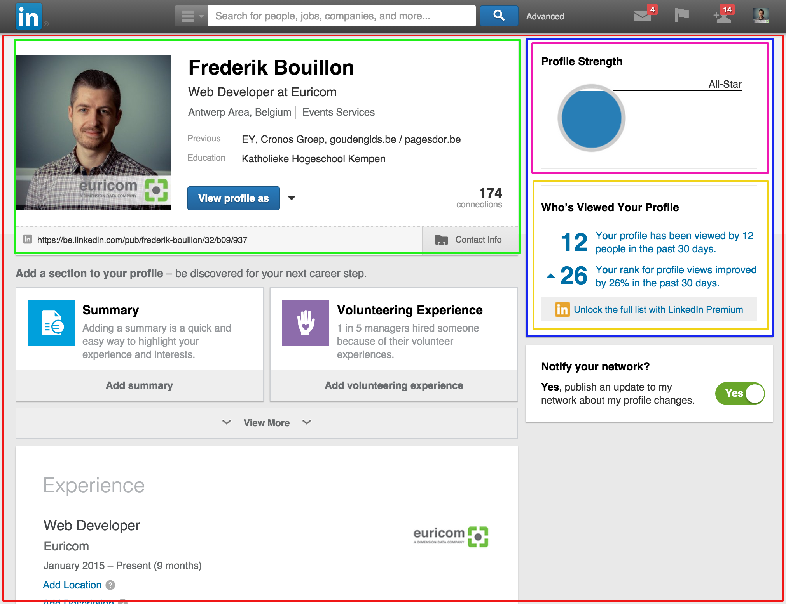

#React 
React is an open-source javascript library for building user interfaces. We could say it's the V (View) from MVC or just "the view layer".

Comparing React to Angular or Ember would be unfair because React isn't trying to be a full javascript framework. It's just trying to be the view layer, which it's really good at!

React is developed by Facebook for solving 1 problem:
***Build large applications that use data that changes over time***

Growth of React vs the rest:
<a href="http://dev.cetrez.com/reactstats/">Click</a>

##React fundamentals
React is component based. When we build a user interface with React, it's just a set of nested React components.

Components are the building blocks of React. We could compare them with Angular directives.

A React component is a collection of HTML, CSS, JS, and some internal data specific to that component. We define these components either in pure JavaScript or they can be defined in what the React team calls

