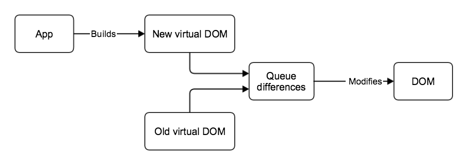

##The Virtual DOM
React will never communicate directly to the actual DOM, which is why React is known to be so performant.

The reason why we need to define our React components with JSX or javascript objects is because React will build a very fast in-memory javascript representation of the actual DOM.

React can keep track of the difference between the current virtual DOM (computed after some data changes), with the previous virtual DOM (computed before some data changes).

React then isolates the changes between the old and new virtual DOM and then only updates the real DOM with the necessary changes. Because manipulating the actual DOM is slow, React is able to minimize manipulations to the actual DOM by keeping track of a virtual DOM and only updating the real DOM when necessary and only with the necessary changes.

Typically user interfaces have lots of state which makes managing state difficult. By re-rendering the virtual DOM every time any state change occurs, React makes it easier to think about what state your application is in.

The process looks something like this:

**1. SIGNAL TO NOTIFY OUR APP SOME DATA HAS CHANGED**  
**2. RE-RENDER VIRTUAL DOM**  
**3. DIFF PREVIOUS VIRTUAL DOM WITH NEW VIRTUAL DOM**  
**4. ONLY UPDATE REAL DOM WITH NECESSARY CHANGES**
