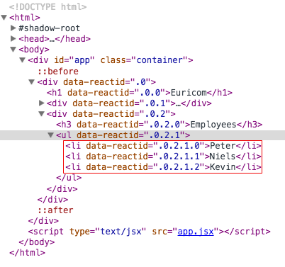

#Props
##Receiving state from parent component
Another way to get application data into a component is by Props.

Props is the data which is passed to the child component from the parent component. This allows for our React architecture to stay pretty straight forward. Handle state in the highest most parent component which needs to use the specific data, and if you have a child component that also needs that data, pass that data down as props.

Here’s a very basic example of using props:

    // helloWorld.jsx
    var HelloWorld = React.createClass({
        render: function(){
            return (
                <h1>Hello {this.props.name}!</h1>
            )
        }
    });

    ReactDOM.render(<HelloWorld name="Euricom"/>, document.getElementById('app'));

Notice in our React.render we have an attribute called name with a value of "Euricom". Now in our component, we can use {this.props.name} to get "Euricom".

Another way to pass props is by transclusion, or in other words, as element content:

    var HelloWorld = React.createClass({
        render: function(){
            return (
                

                    <h1>{this.props.children}</h1>
                

            )
        }
    });

    ReactDOM.render(<HelloWorld>Hello world</HelloWorld>,
        document.getElementById('app'));

We get a hold of the parent his content by *this.props.children*.

Let’s look at a more advanced example. We’re going to have two components now. One parent, one child. The parent is going to keep track of the state and pass a part of that state down to the child as props.

Let’s first take a look at that parent component:

    // app.jsx
    var EmployeeContainer = React.createClass({
        getInitialState: function() {
            return {
                company: 'Euricom',
                employees: ['Peter', 'Niels', 'Kevin']
            }
        },

        render: function() {
            return (
                

                    <h1>{this.state.company}</h1>
                    <EmployeeList employees={this.state.employees}/>
                

            )
        }
    });

There really isn’t much going on in this component that we haven’t seen before. We have an initial state and we pass part of that initial state to another component.

The majority of the new code will come from this child component so let’s take a closer look at that:

    // app.jsx
    var EmployeeList = React.createClass({
        render: function() {
            return (
                

                    <h3>Employees</h3>
                    <ul>
                        {this._renderItems()}
                    </ul>
                

            )
        },

        _renderItems: function() {
            return this.props.employees.map(function(employee) {
                return <li>{employee}</li>
            })
        }
    })

In our child component we want to print out the list of employees which we passed down from our parent component.

We want to print these out as an unordered list (ul) so we need to convert the array of strings to an array of list items (li). For this process we are going to create a function (renderItems) which will handle this for us.

If you’re not familiar with Array.prototype.map, this code might look a little weird. All map does is it creates a new array, calls our callback function on each item in the array, and fills the new array with the result of calling the callback function on each item.

In this case we will loop over every string in our array and transform them to list items.

The result of our map function will return the following:

    ["<li>Peter</li>", "<li>Niels</li>", "<li>Kevin</li>"];

Finally we call our renderItems function in our render (by surrounding it with { }) to fill our < ul > with the list items.

###Key
When we take a look at our console, we notice this warning:

    Warning: Each child in an array or iterator should have a unique "key" prop. Check the render method of EmployeeList. See https://fb.me/react-warning-keys for more information.

The warning gives us a good description on why it's being thrown. When rendering items from an array we should add a (unique - inside the rendered collection) key attribute.

Think of the *key* property as a unique identifier for the components being returned from *map*.

Key point:

    When React reconciles the keyed children, it will ensure that any child with key will be reordered (instead of clobbered) or destroyed (instead of reused).

When we take a look at the rendered elements in our dev tools:

Let's review our EmployeeList component:

    var EmployeeList = React.createClass({
        render: function() {
            return (
                

                    <h3>Employees</h3>
                    <ul>
                        {this._renderItems()}
                    </ul>
                

            )
        },

        _renderItems: function() {
            return this.props.employees.map(function(employee, index) {
                return <li key={index}>{employee}</li>
            })
        }
    });

We can use the second argument from our map function (index) to use as our key.

The *data-reactid* of our rendered elements have been edited, notice the addition of **$**:

##Receiving functionality from parent component
It’s important to understand that wherever the data lives, is the exact place you want to manipulate that data. This keeps it simple to reason about your data. All getter/setter methods for a certain piece of data will always be in the same component where that data was defined.

If you needed to manipulate some piece of data outside where the data lives, you’d pass the getter/setter method into that component as props. Let’s take a look at an example like that.

We're going to add a new component (AddNewEmployee) to our previous example. We'll render an input box and a button so we can add a new employee to our list.

    var AddEmployee = React.createClass({
        render: function() {
            return (
                

                    
Add new employee

                    <input  type="text"
                            value={this.props.newEmployee}
                            onChange={this.props.onChange}/>
                    <button onClick={this.props.addNew}>add new</button>
                

            )
        }
    });

If we take a look at our new component, we can see that it doesn't do much besides rendering some HTML.

All the logic is being passed by our parent (EmployeeContainer) component. Since our parent holds our state, we'll also put all the logic that can manipulate our state there.

Our updated parent component (EmployeeContainer):

    var EmployeeContainer = React.createClass({
        getInitialState: function() {
            return {
                company: 'Euricom',
                employees: ['Peter', 'Niels', 'Kevin'],
                newEmployee: ''
            }
        },

        render: function() {
            return (
                

                    <h1>{this.state.company}</h1>
                    <AddEmployee    newEmployee={this.state.newEmployee}
                                    onChange={this._changeHandler}
                                    addNew={this._addNewEmployee}/>
                    <EmployeeList employees={this.state.employees}/>
                

            )
        },

        _changeHandler: function(e) {
            this.setState({
                newEmployee: e.target.value
            })
        },

        _addNewEmployee: function() {
            this.setState({
                employees: this.state.employees.concat(this.state.newEmployee),
                newEmployee: ''
            })
        }
    });

In the example above we've added our AddEmployee component in our render function. We pass in 3 arguments:

- **newEmployee**: a state variable which will be used as a value for our input box
- **onChange**: a function (_changeHandler) which will be used to respond on every value change in our input box. Everytime the value changes, we update the newEmployee variable (on our state).
- **addNewEmployee**: a function which will add the new employee to the list of employees on our state. We also empty our newEmployee for new input.

**EXERCISE**
[Complete exercise 1](https://github.com/Euricom/frontend-bootcamp-2015Q4/blob/master/topics/React/exercises/Chapter%201:%20The%20basics/exercise.md#1-userapp-in-react)

##Proptypes
As your app grows it's helpful to ensure that your components are used correctly. We do this by allowing you to specify propTypes. React.PropTypes exports a range of validators that can be used to make sure the data you receive is valid. When an invalid value is provided for a prop, a warning will be shown in the console.

propTypes allow you to control the presence, or types of certain props passed to the child component. With propTypes you can specify that certain props are required or that certain props be a specific type.

    var AddEmployee = React.createClass({
        propTypes: {
            newEmployee: React.PropTypes.string.isRequired,
            onChange: React.PropTypes.func.isRequired,
            addNew: React.PropTypes.func.isRequired
        },
        render: function() {
            return (
                

                    
Add new employee

                    <input  type="text"
                                    value={this.props.newEmployee}
                                    onChange={this.props.onChange}/>
                    <button onClick={this.props.addNew}>add new</button>
                

            )
        }
    });

In the example above we define all our props with their type. Notice we can specify if a prop is required or not. If a required prop is not passed by it's parent or if it's not a function a warning will be thrown:

    Warning: Failed propType: Required prop `addNew` was not specified in `AddEmployee`. Check the render method of `EmployeeContainer`.

But even if a prop is not required, a warning will always be thrown if the expected prop has a different type than defined:

    Warning: Failed propType: Invalid prop `errors` of type `array` supplied to `AddEmployee`, expected `object`. Check the render method of `EmployeeContainer`.

It's recommended to always specify propTypes. It gives developers a quick overview of all used props and if they are required or not.

**EXERCISE**
[Complete exercises 2](https://github.com/Euricom/frontend-bootcamp-2015Q4/blob/master/topics/React/exercises/Chapter%201:%20The%20basics/exercise.md#2-userapp-proptypes)

##getDefaultProps
Allows you to specify a default (or a backup) value for certain props just in case those props are never passed into the component.

    var EmployeeList = React.createClass({
        propTypes: {
            employees: React.PropTypes.array
        },
        getDefaultProps: function() {
            return {
                employees: ['Wart Claes']
            }
        },
        render: function() {
            return (
                

                    <h3>Employees</h3>
                    <ul>
                        {this._renderItems()}
                    </ul>
                

            )
        },

        _renderItems: function() {
            return this.props.employees.map(function(employee, index) {
                return <li key={index}>{employee}</li>
            })
        }
    });