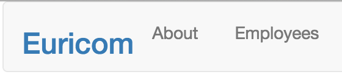

React-router is a powerful routing library built on top of React that helps you add new screens and flows to your application.

##Example
We're going to implement react-router in our previous example. For this example we are going to add a navigation bar.

- **Euricom** will behave as our homepage
- **About** will show us an about page
- **Employees** will hold our existing employeeContainer

Since we already have our components to render on the employees page, we'll add 2 new components which we'll use to render the homepage and about:

    // app/components/about.jsx
    import React from 'react';

    export default React.createClass({
        render: function() {
            return (
                

                    
About

                

            )
        }
    });

-

    // app/components/home.jsx
    import React from 'react';

    export default React.createClass({
        render: function() {
            return (
                

                    
Home

                

            )
        }
    }); 

Now we've defined our different pages, it's time to install react-router:

    npm install react-router --save

In our example, our app component is used as an entry point for our application. But it doesn't do much except rendering our employeesContainer component.

Since it's our entry point, it's a good place to define our routes:

    // app/app.jsx
    import React from 'react';
    import ReactDom from 'react-dom';
    import { Router, Route, IndexRoute } from 'react-router';
    import EmployeeContainer from './components/employeeContainer.jsx';
    import Home from './components/home.jsx';
    import About from './components/about.jsx';

    var App = React.createClass({
        ...
    });

    //ReactDom.render(<EmployeeContainer />, document.getElementById('app'));
    ReactDom.render((
      <Router>
        <Route path="/" component={App}>
          <IndexRoute component={Home}/>
          <Route path="about" component={About}/>
          <Route path="employees" component={EmployeeContainer} />
        </Route>
      </Router>
    ), document.getElementById('app'))

As we can see in the example above, instead of rendering our emplyeeContainer, we're going to pass in our Route configuration in the React.render method.

We can pass in this config in JSX syntax. Our config consists of a < Router > which can hold several nested routes. On these routes we can add an attribute 'path' which will be a part of our URL. We add a second attribute 'component' which is the react component that will be rendered.

We render our App component at the root so it'll be on every page:

    // app/app.jsx
    ...
    import NavBar from './components/navbar.jsx';

    var App = React.createClass({
        render: function() {
            return (
                

                    <NavBar />          
                    {this.props.children}               
                
      
            )
        }
    });

    ReactDom.render(...)

In our app component, we render our navbar (so it'll be present on every route). Next we'll render our children via props. These children are the ones which we defined inside our route with path "/".

    <Route path="/" component={App}>
      <IndexRoute component={Home}/>                            <--
      <Route path="about" component={About}/>                   <--
      <Route path="employees" component={EmployeeContainer} />  <--
    </Route>

We render our App component on "/". But suppose we want to render a homepage at this route. We handle this by using an IndexRoute. This way we can keep our App component rendering the navbar and our Home component will be passed as this.props.children on the "/" route.

Next we'll define our navBar:

    // app/components/navBar.jsx
    import React from 'react';
    import { ReactRouter, Link } from 'react-router';

    export default React.createClass({
        render: function() {
            return (
                <nav className='navbar navbar-default'>
                    

                        <ul className='nav navbar-nav'>
                            <li><h3><Link to="/">Euricom</Link></h3></li>
                            <li><Link to="/about">About</Link></li>
                            <li><Link to="/employees">Employees</Link></li>
                        </ul>
                    

                </nav>
            )
        }
    });

We can navigate to other routes by using the Link component provided by React-Router. We simply provide the route in the 'to' attribute.

###history

history is a JavaScript library that lets you easily manage session history in browsers. When installing react-router, history comes with it.

Next we create a reference for the browserHistory:

    import { createHistory } from 'history';

Finally we pass this on to our router:

    <Router history={createBrowserHistory()}>
        ...
    </Router>
